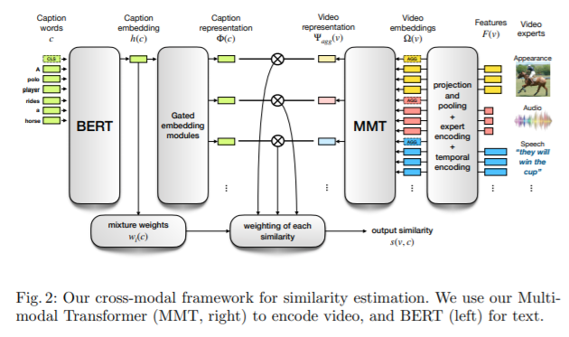

# [Paper] Multi-modal Transformer for Video Retrieval

**Author: Valentin Gabeur, Chen Sun, Karteek Alahari, Cordelia Schmid**

**[Link](https://arxiv.org/pdf/2007.10639.pdf)**

#paper #multi-modal #transformer #video #retrieval #language

## Main Idea

Propose a two stream network architecture. One for language and one for video.
* Language branch, use BERT and Gated Embedding module for word embedding, we extract embedding $h(c)$ from [CLS] output of BERT, then use a function $g$ to project it into N different spaces.
* Video branch, use several Export models to extract features for video (Motion, Audio, Scene, OCR, Speech, Appearance) represented by $F^n(v)$, then Expert embeddings $E^n(v)$ is learnt to distinguish different expert features, and Temporal embeddings $T(v)$ are used to provide temporal information (from 1s to Ds). Final feature $\Omega(v)=F(v)+E(v)+T(v)$ is fed into a transformer to genearte aggregated feature.

## Network Architecture

## Loss function and Metrics
* Similarity estimation, weighted sum of each expert $i$'s video-caption similarity $\langle \phi^i, \psi^i_{agg} \rangle$, which can bedescribed as $s(v,c)=\Sigma^{N}_{i=1} w_i (c) \langle \phi^i, \psi^i_{agg} \rangle$ where $w_i (c)$ is the weight of $i$ expert. Weight is calculated by a softmax function.
* Loss function is bi-directional max-margin ranking loss, can be described as $\mathcal{L}=\frac{1}{B}\Sigma^{B}_{i=1}\Sigma_{j\neq i}[max(0, s_{ij}-s{ii}+m)+max(0, s_{ji}-s{ii}+m)]$ where $B$ is batch size, this loss function enforce similarity for true pair higher than negative pair.
