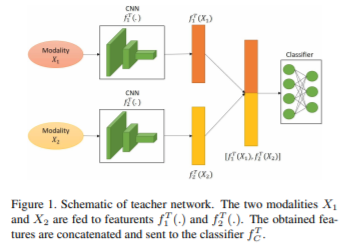
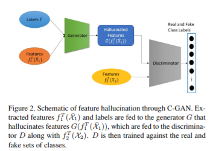
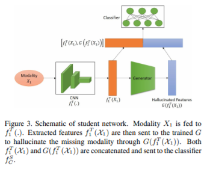

# [Paper] An Adversarial Approach to Discriminative Modality Distillation for Remote Sensing Image Classification

**Author: Shivam Pande, Avinandan Banerjee, Saurabh Kumar, Biplab Banerjee, Subhasis Chaudhuri**

**[Link](https://openaccess.thecvf.com/content_ICCVW_2019/papers/CROMOL/Pande_An_Adversarial_Approach_to_Discriminative_Modality_Distillation_for_Remote_Sensing_ICCVW_2019_paper.pdf)**

#paper #gan #multi-modal #knowlege-distillation

## Main Idea
Combine generative adversarial network, multi-modal and knowledge distillation together. The network is capable to learn discriminative feature representations corresponding to missing modality. The proposed network contains three parts.
1. Teacher Network

2. C-GAN

3. Student Network

When training, first train the teacher network, consider a dataset $X=\{x^i_1,x^i_2,y\}^N_{i=1}$ where $x_1$ and $x_2$ are two modalities, $y$ denotes the class label. We then train the teacher model.

For C-GAN, we halluciate $f^T_2(x^i_2)$ given $f^T_1(x^i_1)$ as input through halluciation model $\mathcal{H}$, then the discriminative model $\mathcal{D}$ will output the result consider whether the sample is from the generative model $\mathcal{G}$ or from real sample.

For student network, we only have modality $x_1$, we first generate feature $f^T_1(x_1)$, then through the generator, we generate the missing modality $G(f^T_1(x_1))$, then we concatenate these two features and do classification.

## Loss function and Metircs
1. Teacher Network $\mathcal{L}_T=-E_{(x^i_1,x^i_2,y^i)\in{X}}[y^i log f^T_C(\hat x^i)]$
2. C-GAN $min_G max_D \mathcal{L}_{hal}=E_{(\hat x^j_1, \hat y^j_1, y_j)}[log D(G(f^T_1(\hat x^j_1|y^j, \hat y^j)))]+E_{(x^j_2, \hat y^j, y^j)}[log D(f^T_2(x^j_2), \hat y^j)]$
3. Student Network $\mathcal{L}_S=-E_{(\hat x^j, y^j)}[y^j log f^S_C (\hat x^j)] + \lambda(||q^j_T - q^j_S||_2)$