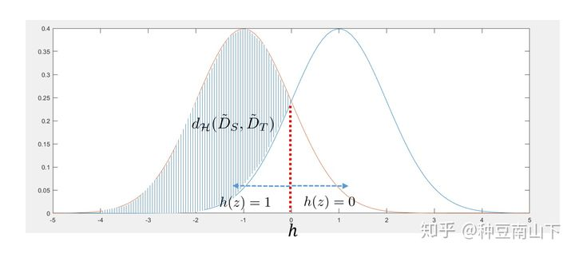

# [Theory] 领域自适应的理论分析

#domain-adaptation #theory

原文[《迁移学习》: 领域自适应(Domain Adaptation)的理论分析](https://zhuanlan.zhihu.com/p/50710267)

## 概念与目的
领域自适应(Domain Adaptation)是迁移学习中很重要的一部分内容，目的是把分布不同的源域(source domain)和目标域(target domain)的数据，映射到同一个特征空间中，使其在该空间中的距离尽可能近。因此，在特征空间中对source domain训练的目标函数就可以迁移到target domain上来。

## 理论分析
### 1. 问题建立
$\mathcal{X}$是一个实例集合(instance set) 
$\mathcal{Z}$是一个特征空间 
$\mathcal{D}_S$是定义在$\mathcal{X}$的source domain distribution，$\hat{\mathcal{D}_S}$是定义在$\mathcal{Z}$上的source domain distribution 
$\mathcal{D}_T$, $\hat{\mathcal{D}_T}$是target domain的数据分布以及特征分布 
$\mathcal{R}:\mathcal{X}->\mathcal{Z}$是表征函数(representation function)，作用是将实例$\mathcal{X}$映射到特征空间$\mathcal{Z}$上 
$f:\mathcal{X}->\{0,1\}$是真实的标签函数，是二值函数，我们希望通过训练得到$f$ 
$h:\mathcal{Z}->\{0,1\}$是我们设计的预测函数，给定一个特征$z\in\mathcal{Z}$，该函数输出一个对应的标签 
$\mathcal{H}$是二值函数的集合，$h\in\mathcal{H}$

我们接下来定义从特征到标签的映射函数 
$$\hat{f}(z)\overset{def}{=}E_{x\sim{\hat{D}_S}}[f(x)|R(x)=z]$$
Note: $\hat{f}$是随机的，因为即使$f$是确定的映射函数，给定特征$z$的情况下，$z$也可能以不同的概率来自不同的$x$

预测函数$h$在source domain上的错误率可以理解为 
$$\epsilon_{S}(h)=E_{z\sim{\hat{D}_S}}|\hat{f}(z)-h(z)|$$

### 2. 度量准则
我们需要设计一个度量准则，通过$\mathcal{R}$映射到特征空间的特征分布$\hat{\mathcal{D}}_S, \hat{\mathcal{D}}_T$之间的距离，该距离需要满足条件：能通过有限个样本数据计算

我们定义该距离为$\mathcal{A}$距离
$$d_{\mathcal{A}}(\hat{D}_S, \hat{D}_T)=2\underset{A\in\mathcal{A}}{sup}|Pr_{\hat{D}_S}[A]-Pr_{\hat{D}_T}[A]|$$
其中$\mathcal{A}$是博莱尔集，$A$是其一个子集，该式的意思是取遍$\mathcal{A}$的子集，找出在$\hat{D}_S$ $\hat{D}_T$上概率差的最大值，$sup$为最小上界

给$A$一个具体的值
$$A->I(h)=\{ z\in\mathcal{Z}:h(z)=1,h\in\mathcal{H}\}$$

此时的$\mathcal{A}$距离可以记作$\mathcal{H}$距离
$$d_{\mathcal{H}}(\hat{D}_S,\hat{D}_T)=2\underset{h\in\mathcal{H}}{sup}|Pr_{\hat{D}_S}[I(h)]-Pr_{\hat{D}_T}[I(h)]|$$

此图中，两个高斯分布代表着source domain和target domain的特征分布，$Pr_{\hat{D}_S}$和$Pr_{\hat{D}_T}$，$h$如图中红线所示，左侧为$h(z)=1$，那么$Pr_{\hat{D}_S} [I(h)]$就是左侧高斯分布在$h$的左侧部分，$Pr_{\hat{D}_T}[I(h)]$就是右侧高斯分布在$h$的左侧部分，涂黑部分为$d_{\mathcal{H}}(\hat{D}_{S},\hat{D}_T)$，由于我们需要取上确界，因此集合$I(h)\in{(-\infty，0)}$

我们在$\mathcal{H}$距离的基础上再定义$\mathcal{H}\triangle\mathcal{H}$距离
$$\begin{aligned}
d_{\mathcal{H}\triangle\mathcal{H}}(\hat{D}_S,\hat{D}_T)&=2\underset{h_1,h_2\in\mathcal{H}}{sup}|Pr_{\hat{D}_S}[{z:h_{1}(z)\neq{h_{2}(z)}}]-Pr_{\hat{D}_T}[{z:h_{1}(z)\neq{h_{2}(z)}}]|\\
&=2\underset{\eta\in\mathcal{H}\triangle\mathcal{H}}{sup}|Pr_{\hat{D}_S}[z:\eta(z)=1]-Pr_{\hat{D}_T}[z:\eta(z)=1]|
\end{aligned}$$
where $z^*=\{z:h_{1}(z)\oplus h_{2}(z),h_{1}, h_{2} \in \mathcal{H}\}$，$\mathcal{H}\triangle\mathcal{H}=\{\eta:\eta(z^*)=1\}$，$\oplus$：XOR

此图中，两个高斯分布同样代表source domain和target domain上的特征分布，$h_1$和$h_2$如图中两条红线所示，那么$Pr_{\hat{D}_S}[z:h_{1}(z)\neq h_{2}(z)]-Pr_{\hat{D}_T}[z:h_{1}(z)\neq h_{2}(z)]$就可以理解成图中涂黑部分，因为只有在涂黑部分才满足存在$z$使得$h_{1}(z)\neq h_{2}(z)$

$d_{\mathcal{H}\Delta\mathcal{H}}(\hat{D}_{S},\hat{D}_T)$可以定义为
$$\begin{align}
d_{\mathcal{H}\Delta\mathcal{H}}(\hat{D}_{S},\hat{D}_T)&=2\underset{\eta\in{\mathcal{H}\Delta\mathcal{H}}}{sup}|Pr_{\hat{D}_S}[z:\eta(z)=1]-Pr_{\hat{D}_T}[z:\eta(z)=1]|\\
&\leq 2\underset{\eta\in\mathcal{H}_d}{sup}|Pr_{\hat{D}_S}[z:\eta(z)=1]-Pr_{\hat{D}_T}[z:\eta(z)=1]|\\
&=2\underset{\eta\in{\mathcal{H}_d}}{sup}|Pr_{\hat{D}_S}[z:\eta(z)=1]+Pr_{\hat{D}_T}[z:\eta(z)=0]+1|
\end{align}$$

其中，函数$\mathcal{H}_d$只要比$\mathcal{H}\Delta\mathcal{H}$复杂即可，我们只需要将神经网络设计的复杂一些即可 
该公式可以理解为，在一个复杂度足够的函数类$\mathcal{H}_d$（可以实现异或操作或更复杂运算）中，我们只要找到一个函数$\eta$，使得来自$\hat{D}_S$的特征被判为1的可能性最大化，使得来自$\hat{D}_T$的特征被判为0的可能性最大化，我们就能找到$d_{\mathcal{H}\Delta\mathcal{H}}$的最小上界

### 3. 误差界
Theorem: Let R be a fixed representation function from $\mathcal{X}$ to $\mathcal{Z}$, $\mathcal{H}$ is a binary function class, for every $h\in\mathcal{H}$
$$
\epsilon_T(h)\leq \epsilon_S(h)+\frac{1}{2}d_{\mathcal{H}\Delta\mathcal{H}}(\hat{D}_S,\hat{D}_T)+\lambda
$$
where
$$\begin{align}
\lambda&=\epsilon_S(h^*)+\epsilon_T(h^*)\\
h^*&=\underset{h\in\mathcal{H}}{argmin}\epsilon_S(h)+\epsilon_T(h)
\end{align}$$

该定理表示，分类函数$h$在target domain上的错误率，被三个项所限定，第一项是$h$在source domain上的错误率，第二项是通过$\mathcal{R}$将source domain和target domain中的特征投影到$\mathcal{Z}$中，两者特征分布的距离，即$d_{\mathcal{H}\Delta\mathcal{H}}$，第三项是一个常数项

从此图中我们可以看出要降低$\epsilon_T(h)$，函数$G_f$需要降低$h$在source domain上的错误率，同时也需要减少$d_{\mathcal{H}\Delta\mathcal{H}}$，$G_y$需要降低在source domain上的错误率 
$G_d$则尽可能的取$d_{\mathcal{H}\Delta\mathcal{H}}(\hat{D}_S,\hat{D}_T)$的上确界，让自己能尽量代表这个距离，而$G_f$则是想要减少上确界本身