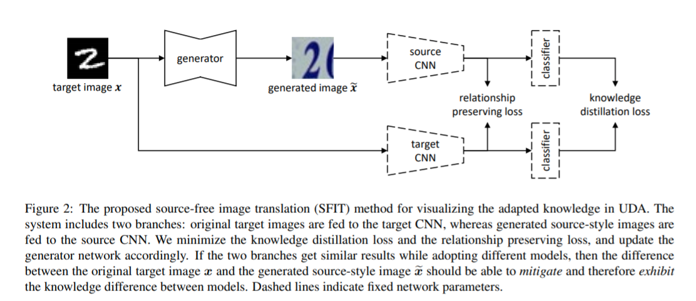
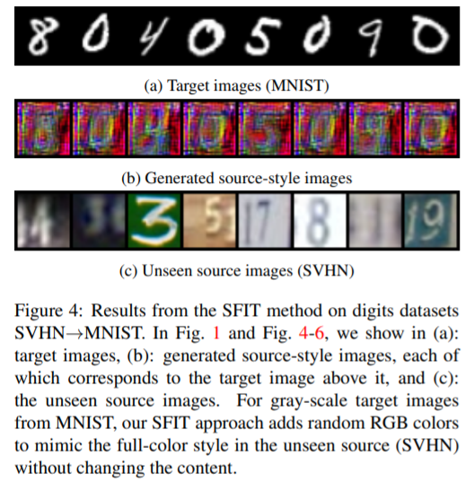
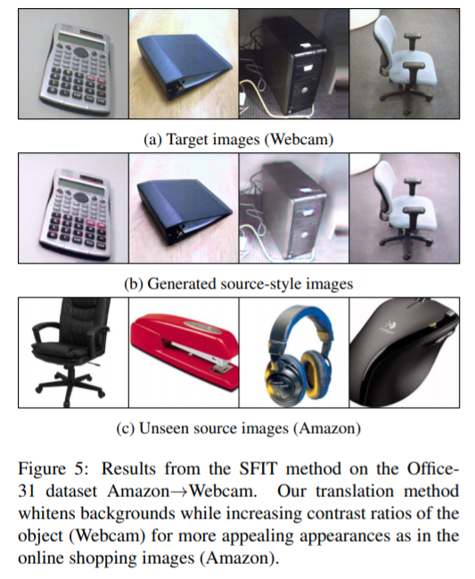
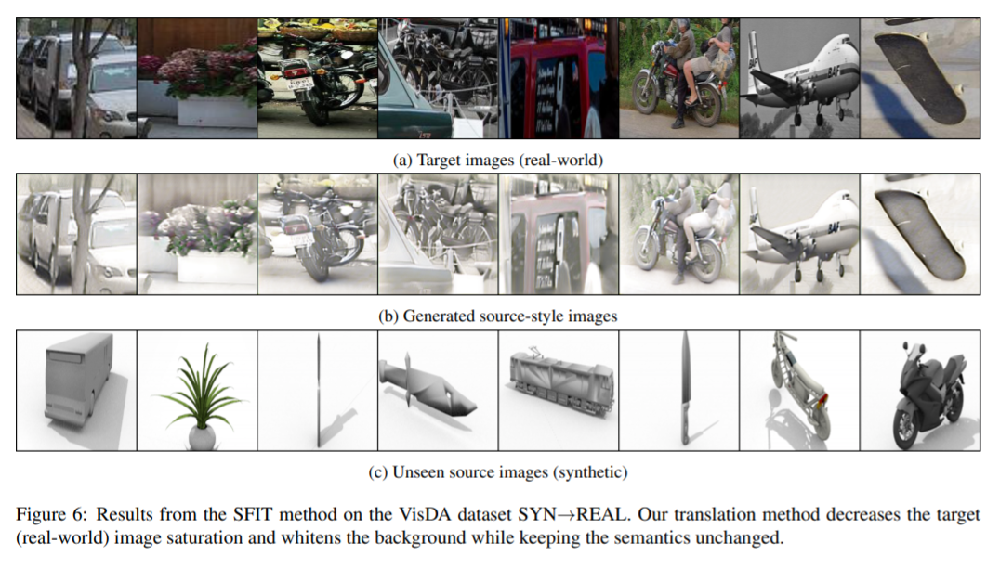

# [Paper] Visualizing Adapted Knowledge in Domain Transfer

**Author: Yunzhong Hou, Liang Zheng**

**[Link](https://arxiv.org/pdf/2104.10602.pdf)**

#paper #domain-adaptation #unsupervised-domain-adaptation #image-style-translation

## Main Idea
To understand the adaptation process, author potray their knowledge difference with image translation. Specifically, author proposed a **source-free image translation method** that generates source-style images using only target images and two models (source domain model and target domain model).

The main process of the method can be described as followed:
1. A translated image and its original version are fed to the two models respectively.
2. Through updating the translated image, outputs from these two branches are forced to become similar.

When such requirements are met, differences between the two images can compensate for and hence represent the knowledge difference between models.

The task of visualizing adapted knowledge can be formulated as a function of the source model, the target model and the image from a certain domain.
$$\mathcal{G}(f_S, f_T, x)->\hat{x}$$
where $f_S$ represents source domain model, $f_T$ represents target domain model, $x$ represents original version of the image while $\hat{x}$ represents translated image.

## Network Architecture

Given a source CNN $f_{S}(\cdot)$, a target CNN $f_{T}(\cdot)$ sharing the same classfier $p(\cdot)$, we train a generator $g(\cdot)$ for SFIT task.

## Loss function
Overall lossfunction equals to Addition of knowledge distillation loss $\mathcal{L}_{KD}$ and relationship preserving loss $\mathcal{L}_{RP}$.
$$\mathcal{L}=\mathcal{L}_{KD}+\mathcal{L}_{RP}$$
### Knowledge distillation loss
Author regards portraying the adapted knowledge in the target model $f_{T}(\cdot)$ with source model and generator combined $f_{S}(g(\cdot))$ as a special case of knowledge distillation. Therefore, a knowledge distilllation loss between generated image-source-model output $p(f_{S}(\hat{x}))$ and targe-image-target-model output $p(f_{T}(x))$ is proposed.
$$\mathcal{L}_{KD}=\mathcal{D}_{KL}(p(f_{T}(x)), p(f_{S}(\hat{x})))$$
where $\mathcal{D}_{KL}(\cdot , \cdot)$ is the Kullback-Leibler divergence.
### Relationship preserving loss
Similar classification outputs indicate a successful depiction of the target model knowledge on the generated images. Since the author assumed a fixed classifier for UDA, the global feature extracted from target CNN and generated image source CNN should be similar after a successful knowledge distillation. Promoting similar channel-wise relationships between feature maps $f_T(x)$ and $f_S(\hat{x})$ helps to achieve this goal.
Channel-wise relationship preserving loss are implemented. Given feature maps $f_{T}(x)$, $f_{S}(\hat{x})$, first reshape them into feature vectors $\mathcal{F}_{S}$ and $\mathcal{F}_{T}$.
$$\begin{align}
f_{S}(\hat{x})\in \mathbb{R}^{D\times{H}\times{W}}\rightarrow\mathcal{F}_S \in \mathbb{R}^{D\times{HW}}\\
f_{T}(\hat{x})\in \mathbb{R}^{D\times{H}\times{W}}\rightarrow\mathcal{F}_S \in \mathbb{R}^{D\times{HW}}
\end{align}$$
Then we calculate the channel-wise self correlations, or Gram matrices.
$$G_{S}=\mathcal{F}_{S}\cdot \mathcal{F}^{T}_{S}, G_{T}=\mathcal{F}_{T}\cdot \mathcal{F}_{T}^{T}$$
where $G_{S}, G_{T}\in \mathbb{R}^{D\times{D}}$, then row-wise $\mathcal{L}_2$ normalization is applied.
$$\hat{G}_{S[i,:]}=\frac{G_{S[i,:]}}{||G_{S[i,:]}||_2}, \hat{G}_{T[i,:]}=\frac{G_{T[i,:]}}{||G_{T[i,:]}||_2}$$
where $[i,:]$ indicates the $i$-th row in a matrix. Then we define the relation preserving loss as mean squared error (MSE) between the normalized Gram matrices.
$$\mathcal{L}_{RP}=\frac{1}{D}||\hat{G}_{S}-\hat{G}_{T}||_{F}^{2}$$
where $||\cdot||_F$ denotes Forbenius norm (entry-wise $\mathcal{L}_2$ norm for matrix).
## Result

